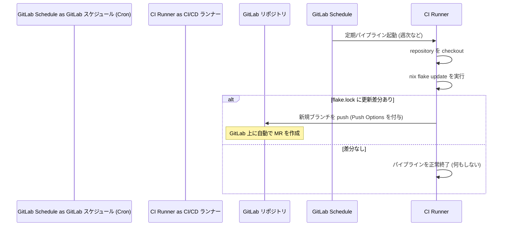

# 📝 GitLab CI/CD による Nix 依存関係の自動マージリクエスト（MR）生成手順 (TODO)

本 dotfiles 環境における Nix Flakes やパッケージの更新チェックおよび適用提案を、GitLab CI/CD を用いて自動化するための導入手順と設定ファイルのテンプレートです。

---

## 🎯 概要

GitLab の **Pipeline Schedules (スケジュール実行)** と **GitLab Push Options** を組み合わせることで、定期的に `nix flake update` を実行し、差分がある場合に自動でマージリクエスト（MR）を作成・提案する仕組みを構築します。

### 🔄 処理フロー



---

## 📋 導入 TODO リスト

### 🔳 Step 1: Project Access Token (プロジェクトアクセストークン) の発行

GitLab CI/CD からリポジトリへ自動で `git push` を行うため、書き込み権限を持つアクセストークンを発行します。

1. GitLab プロジェクトの **Settings > Access Tokens** に移動します。
2. 以下の設定でトークンを作成します：
   * **Token name**: `GITLAB_CI_PUSH_TOKEN`
   * **Role**: `Developer` (ブランチの作成および push に必要)
   * **Scopes**: `write_repository`
3. 生成されたトークンの値をコピーします（一度しか表示されません）。

### 🔳 Step 2: CI/CD 変数 (Variables) の設定

発行したトークンを安全に CI/CD ジョブへ渡すための変数設定です。

1. プロジェクトの **Settings > CI/CD** に移動し、**Variables** セクションを展開します。
2. **Add variable** をクリックし、以下を設定します：
   * **Key**: `CI_PUSH_TOKEN`
   * **Value**: *Step 1 でコピーしたトークン値*
   * **Type**: `Variable`
   * **Protect variable**: `true` (Protected ブランチのみで使用する場合。通常はオンでOK)
   * **Mask variable**: `true` (ログへの漏洩防止のため必須)

### 🔳 Step 3: GitLab CI/CD 設定ファイルの作成

リポジトリのルートに `.gitlab-ci.yml` を作成（または既存ファイルに追記）します。
※ 設定ファイルの具体的な中身は、下記の [`.gitlab-ci.yml` テンプレート](#gitlab-cicd-設定テンプレート) を参照してください。

### 🔳 Step 4: Pipeline Schedule (定期実行) の作成

パイプラインを週次などで定期実行するためのスケジュールを登録します。

1. プロジェクトの **Build > Pipeline schedules** に移動します。
2. **New schedule** をクリックし、以下を設定します：
   * **Description**: `Weekly Nix Flake Update`
   * **Interval Pattern**: `Every Monday at 09:00` (毎週月曜日朝など)
   * **Target branch**: `main` (通常は dotfiles のデフォルトブランチ)
   * **Variables**: ジョブが定期実行時のみ動作するように、以下のスケジュール専用変数を追加します：
     * **Key**: `CRON_UPDATE`
     * **Value**: `true`
3. **Save pipeline schedule** をクリックします。

---

## 🛠️ GitLab CI/CD 設定テンプレート

GitLab 独自の **Git push options** (`-o merge_request.create` 等) を用いることで、複雑な API コール用のスクリプトを書くことなく、単に `git push` するだけで自動的に MR を作成・設定できます。

### 📄 `.gitlab-ci.yml`

```yaml
stages:
  - update

update-flake-job:
  stage: update
  image: nixos/nix:latest # Nix 環境の公式イメージ
  rules:
    # 定期実行スケジュール (CRON_UPDATE 変数が付与されている場合) のみ実行
    - if: '$CRON_UPDATE == "true"'
      when: always
    # 手動実行 (Web UI からの実行) の場合も実行可能にする
    - if: '$CI_PIPELINE_SOURCE == "web"'
      when: always
  before_script:
    # git の初期設定と、Nix Flakes 機能の有効化
    - git config --global user.email "gitlab-ci@example.com"
    - git config --global user.name "GitLab CI Bot"
    - mkdir -p ~/.config/nix
    - echo "experimental-features = nix-command flakes" >> ~/.config/nix/nix.conf
  script:
    # 1. ブランチの切り替え
    - git checkout -B update-nix-dependencies
    # 2. Nix Flake のアップデート
    - nix flake update

    # 3. 差分があるかチェック
    - |
      if git diff --quiet flake.lock; then
        echo "🎉 Nix inputs are already up to date. No changes detected."
        exit 0
      fi

    # 4. コミットの作成と GitLab プッシュオプションを用いた MR 自動生成
    - git add flake.lock
    - git commit -m "chore(deps): update nix flake inputs"
    - |
      git push "https://gitlab-ci-token:${CI_PUSH_TOKEN}@${CI_SERVER_HOST}/${CI_PROJECT_PATH}.git" HEAD:update-nix-dependencies \
        -o merge_request.create \
        -o merge_request.title="🤖 chore(deps): Update Nix Flake inputs" \
        -o merge_request.description="This Merge Request was automatically generated by GitLab CI/CD schedule to update Nix Flake inputs." \
        -o merge_request.remove_source_branch=true \
        -o merge_request.label="dependencies" \
        -o merge_request.label="automated"
```

> [!TIP]
> **GitLab Push Options のメリット**
>
> * `merge_request.create`: プッシュと同時に MR を自動生成します。
> * `merge_request.remove_source_branch=true`: MR マージ後に自動的に作業ブランチ (`update-nix-dependencies`) を削除します。
> * すでに同名のブランチで MR が開いている場合は、新しく MR を作らずに既存のブランチと MR を自動的に上書き更新します。
